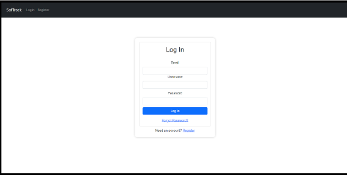
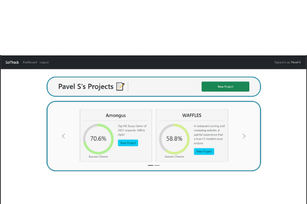
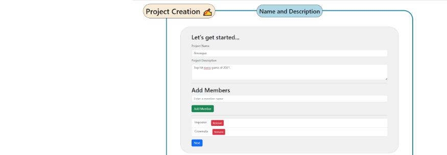
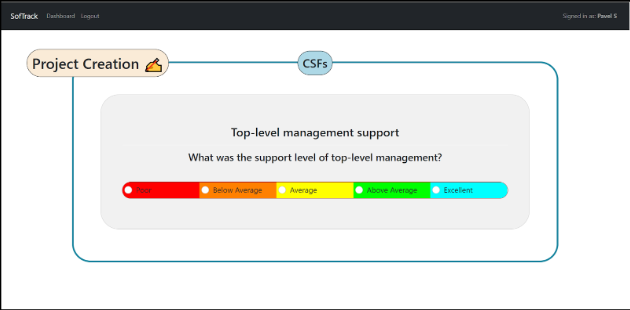
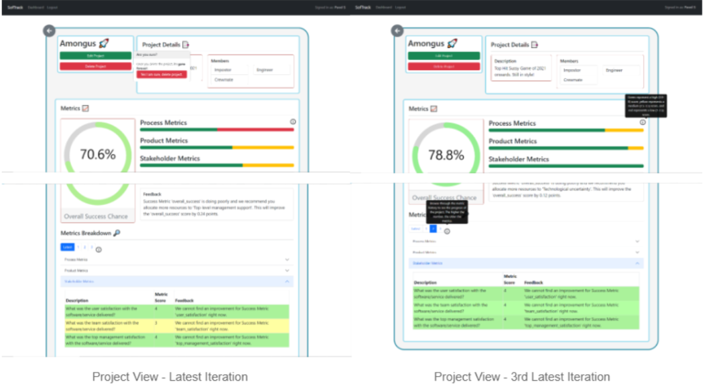

# Deutschbank Software Engineering Success Tracker (SEST)

Our Software Engineering (CS261) Project.

We were tasked with creating a software to help predict and track the success of ongoing projects for Deutschbank.

We developed a KNN Machine Learning algorithm in python, utilising Critical Success Factors (CSFs) on a 1-5 rating to asses project success. 
It also provides specific feedback to the manager based on these factors to improve the overall success chance of the project.
In addition, the PM could review previous iterations of a project and compare them to monitor progress.
THe model adapts and learns when fed previous success factors & overall success of finished projects. 

The backend utilises Django and SQLite to store data and perform functions.

The frontend is made using ReactJS, moving most of the functionality and rendering to the front end. This gave a good split for development,
with responsobilities being shared more easier among the team. It also allowed for a sleeker and faster user interface, which was a highly
desired feature by Deutschbank.

Packages / Instructions:

- Navigate to base folder.
- Download Node.js and Python 3.9.
- Open 2 terminals.

Recommendation: use Conda to create a virtual environment.

In one:

- `python3 -m venv venv in one` or `conda create -n cs261 python=3.9`
- `pip install --user -r requirements.txt`
- `python backend/manage.py makemigrations`
- `python backend/manage.py migrate`
- `python backend/manage.py runserver`

in another:

- `cd ./frontend`
- `npm install react`
- `npm install --save react-circular-progressbar`
- `npm install axios`
- `npm start`

Gallery:
 
Login Screen 
 

 
Dashboard
 

 
Project Creation
 

 
CSF Questions
 

 
Project View
 

